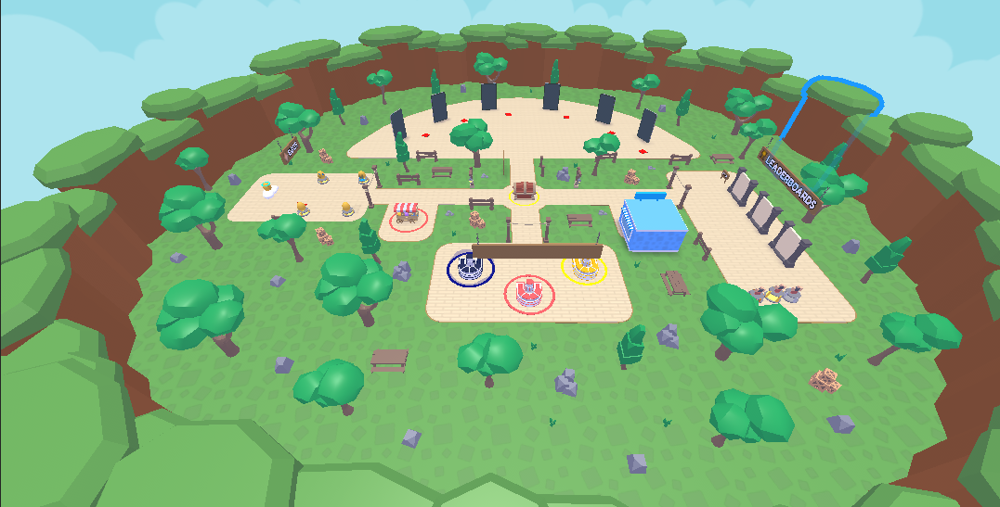
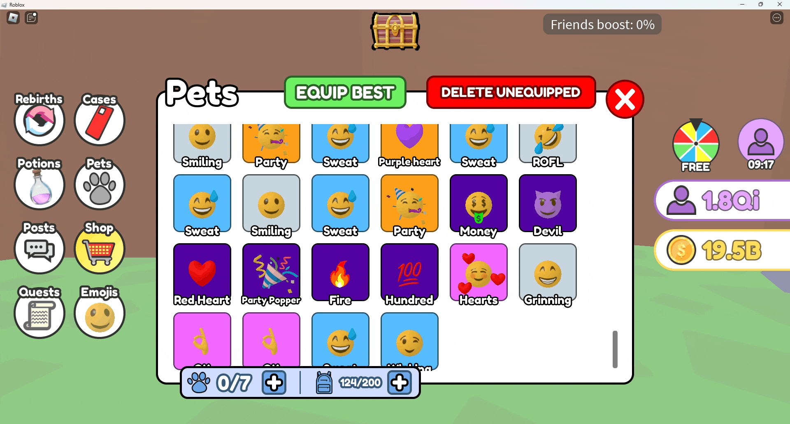
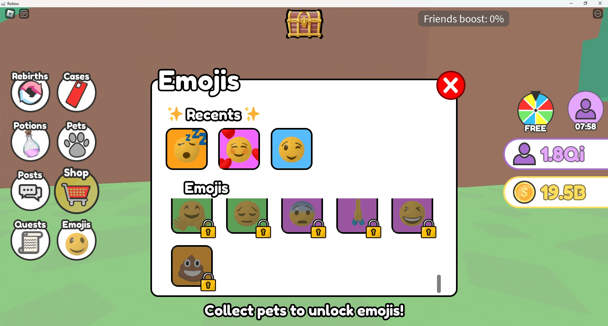
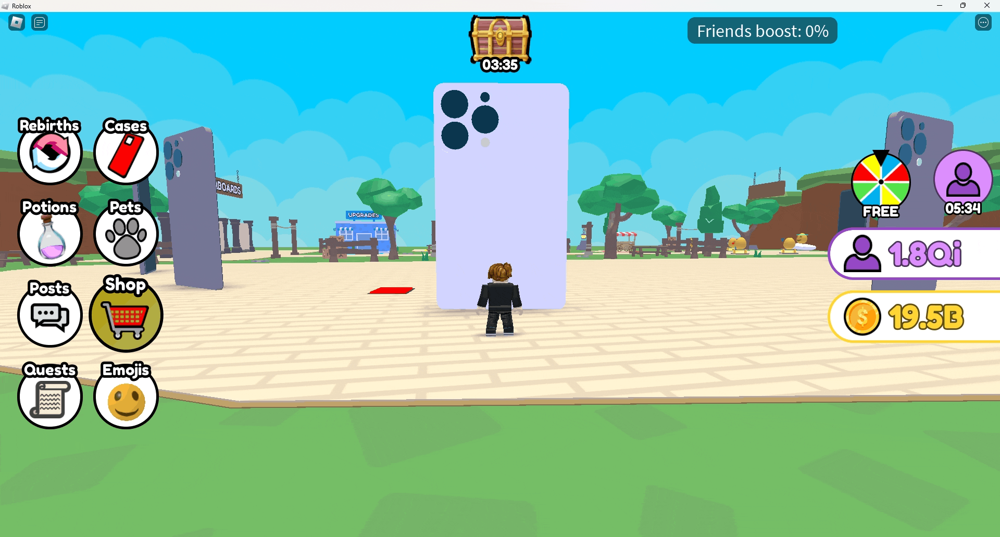
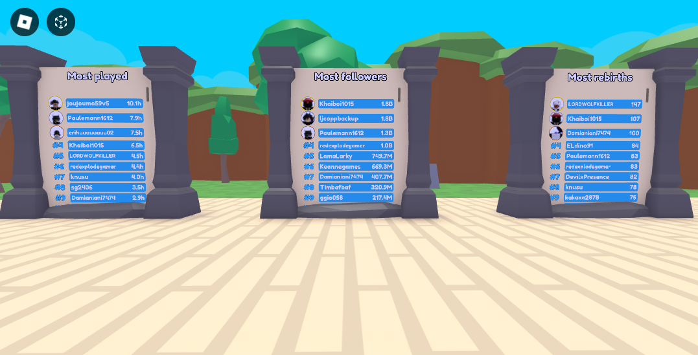
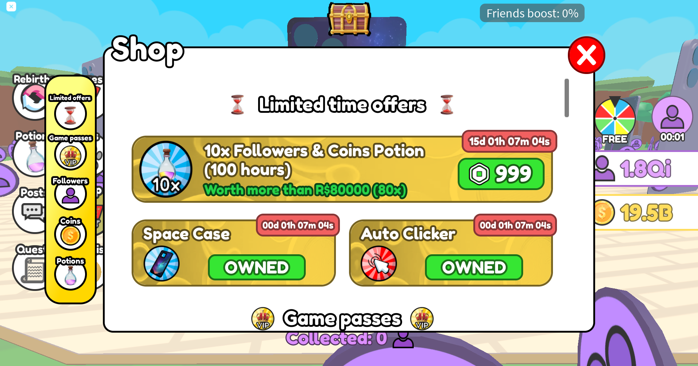

Sommaire

1. [Social Media Simulator](#social-media-simulator)
2. [Statut](#statut)
2. [Projet](#projet)
2. [Screenshots](#screenshots)
2. [Contact](#contact)

# Social Media Simulator

Code source du jeu [Social Media Simulator](https://www.roblox.com/games/14844187553).

Social Media Simulator est un jeu RPG sur Roblox, joué plus de 30k fois avec un ratio de likes de 85%.

Le jeu a été développé en Lua avec le moteur de jeu Roblox Studio.

Le jeu vise un public assez jeune et a été créé pour divertir des enfants autour de l'âge de 13 ans (bien que j'ai essayé de le rendre intéressant pour tous les âges. En fait, la moitié des joueurs avaient plus de 18 ans). Le jeu est, comme le nom le suggère, un "Simulateur" qui est un type de jeu populaire sur Roblox.

Le principe d'un simulateur est assez simple et est centré autour d'une tâche facile à réaliser qui permet de gagner une récompense (des pièces en général). Ces pièces peuvent ensuite être utilisées pour acheter des objets permettant de réaliser cette même tâche plus rapidement. Ce jeu suit ce style et est basé sur une tâche simple mais contient aussi divers fonctionnalités populaires des simulateurs (compagnons, rebirths, quêtes, objets améliorables, personnalisation, classements globaux, récompenses quotidiennes, boosts...)

Le jeu a un style visuel low-poly/cartoon qui est assez attirant (avec des couleurs vives et une géométrie simple) ce qui permet aussi d'améliorer les performances (moins de polygones à afficher).

# Statut

Le projet a atteint un stade satisfaisant et à reçu plusieurs mise à jours pour ajouter du contenu et résoudre des bugs. Cependant, à ce jour, le développement du projet est terminé.

# Projet

J'ai travaillé sur ce projet en tant que projet personnel pendant environ 6 mois. J'ai appris le Lua par moi-même en travaillant sur d'autres projets avant celui-ci (voir [Zombie Invasion: Survive](https://github.com/Quentin-Chauvelon/Zombie_Invasion_Survive) et [Reve Island](https://github.com/Quentin-Chauvelon/Reve_Island)).

Travaillant seul sur ce projet, j'ai du m'occuper de tous les ascpects du jeu : développement, design de l'interface graphique, modélisation 3D, tests, résolution de bugs... ce qui m'a permis d'apprendre et de m'améliorer dans de nombreux domaines.

Depuis, j'ai commencé à travailler sur un nouveau projet en C# que vous pouvez trouver [ici](https://github.com/Quentin-Chauvelon/3D-Ball-Maze)

# Screenshots

  
*View when logging in to the game*

  
*Overall view of the map*

  
*Egg opening sequence*

  
*Equip pet*

  
*Pet upgrade*

  
*Collect playtime rewards*

  
*Emojis reactions*

  
*Quest completed*

  
*Claim quests rewards*

  
*Equip case*

  
*Daily whel spin*

  
*Leaderboards*

  
*Leaderboard podium*

  
*Shop*

# Contact

Email: [quentin.chauvelon@gmail.com](mailto:quentin.chauvelon@gmail.com)

Linkedin: [Quentin Chauvelon](https://www.linkedin.com/in/quentin-chauvelon/)

# Contact

Email: [quentin.chauvelon@gmail.com](mailto:quentin.chauvelon@gmail.com)

Linkedin: [Quentin Chauvelon](https://www.linkedin.com/in/quentin-chauvelon/)
