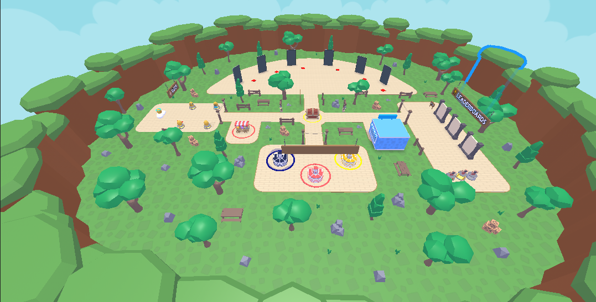
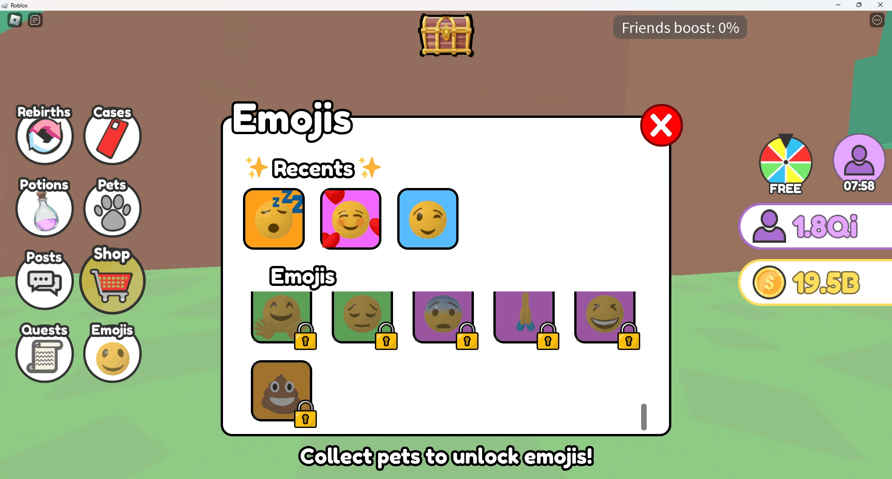
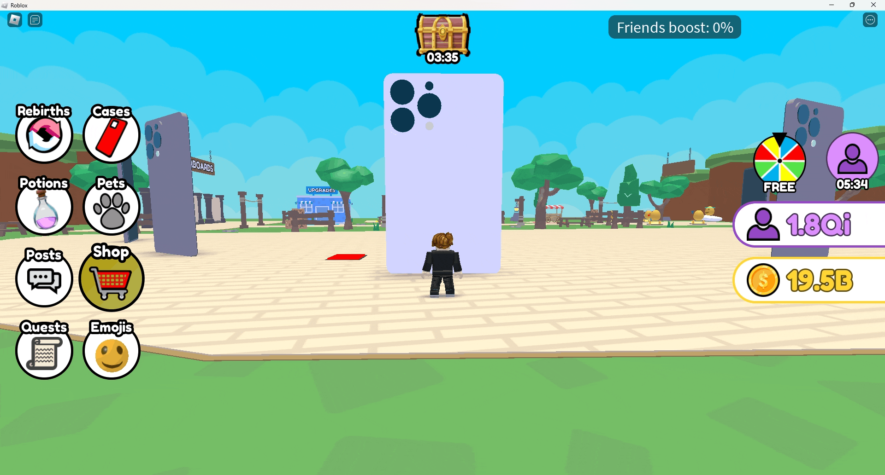
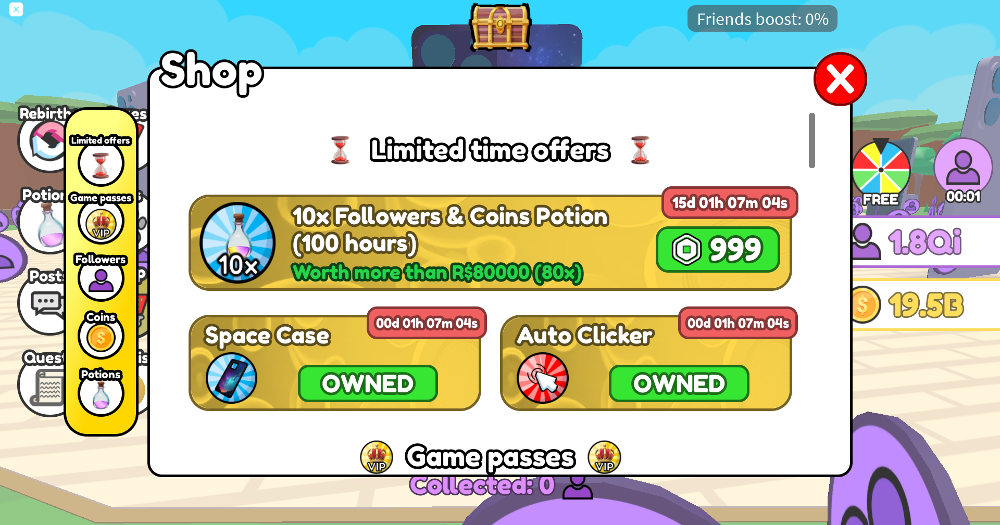

Table of contents

1. [Social Media Simulator](#social-media-simulator)
2. [Status](#status)
2. [Project](#project)
2. [Screenshots](#screenshots)
2. [Contact](#contact)

# Social Media Simulator

Source code of [Social Media Simulator](https://www.roblox.com/games/14844187553).

Social Media Simulator is a Roblox RPG game with over 30k plays and a current like ratio of 85%.

It has been developed in Lua using the Roblox Studio game engine.

This game targets a young audience and has been made to entertain children around the age of 13 (although I tried to make it enjoyable for all ages. In fact, half of the players are more than 18 years old).  The game is, as the name suggests, a “Simulator” which is a popular type of game on Roblox.

A simulator’s gameplay is rather simple as it usually focuses on one easy task which gives you a reward (coins usually). You can use these coins to buy something allowing to complete that task faster. This game follows this style and revolves around one simple task but also incorporates other popular features of simulators (pets, rebirths, quests, items that you can upgrade, customization, leaderboards, daily rewards, boosts...) 

The game has a low poly/cartoony visual style which is pretty appealing (with bright colors and simple geometry) while improving performance (less vertices to render). 

# Status

The project has reached a stable state with multiple updates to add content and fix bugs but is not being actively developed anymore.

# Project

I worked on this as a side project for about 10 months. I learnt Lua by myself by working on other projects before this one (see [Zombie Invasion: Survive](https://github.com/Quentin-Chauvelon/Zombie_Invasion_Survive) and [Reve Island](https://github.com/Quentin-Chauvelon/Reve_Island)).

As a solo developer on the project, I had to work on all aspects of the game: coding, UI designing, 3D modeling, testing, fixing bugs... which allowed me to learn and improve a lot.

Since then, I have started working on a new project in C# that you can find [here](https://github.com/Quentin-Chauvelon/3D-Ball-Maze)

# Screenshots

  
*View when logging in to the game*

  
*Overall view of the map*

  
*Egg opening sequence*

  
*Equip pet*

  
*Pet upgrade*

  
*Collect playtime rewards*

  
*Emojis reactions*

  
*Quest completed*

  
*Claim quests rewards*

  
*Equip case*

  
*Daily whel spin*

  
*Leaderboards*

  
*Leaderboard podium*

  
*Shop*

# Contact

Email: [quentin.chauvelon@gmail.com](mailto:quentin.chauvelon@gmail.com)

Linkedin: [Quentin Chauvelon](https://www.linkedin.com/in/quentin-chauvelon/)
